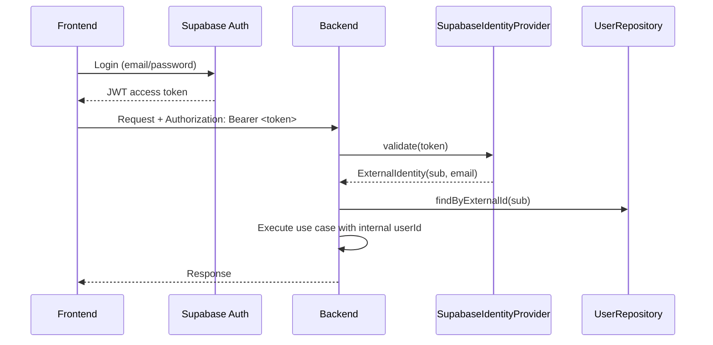
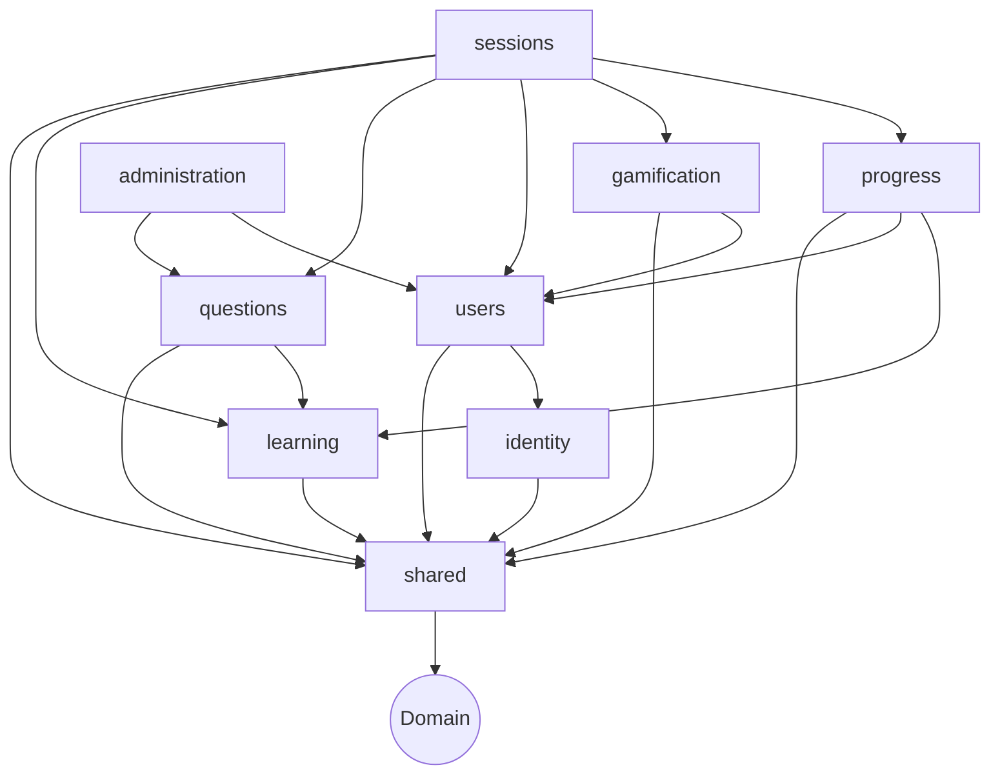
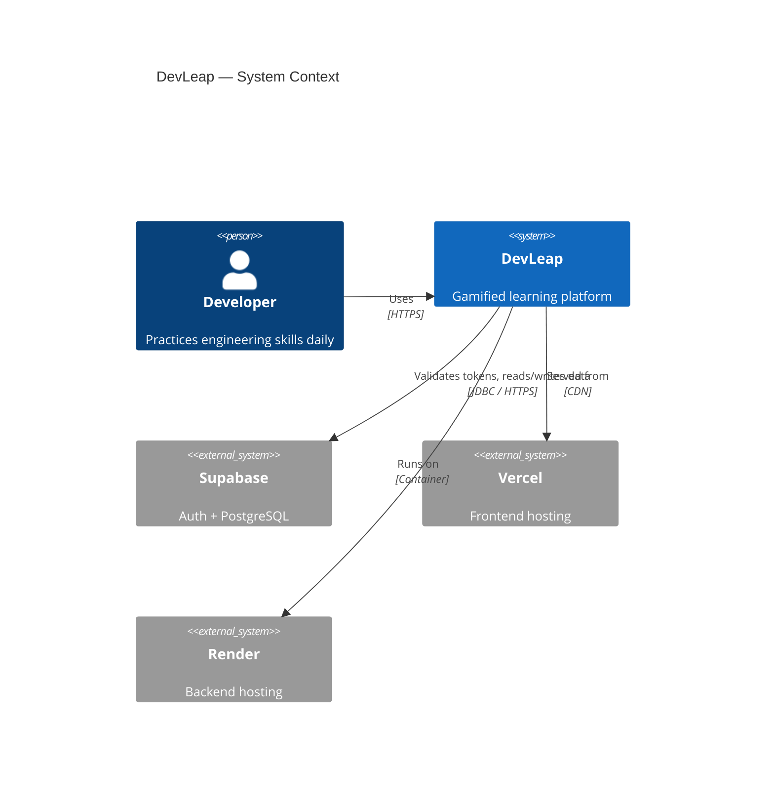

# Architecture — DevLeap

## Overview

DevLeap is implemented as a **modular monolith** following **Hexagonal Architecture** (Ports and Adapters). The backend is a single deployable Spring Boot application organized by business domain rather than technical layer. The frontend is a React SPA served from Vercel.

## Modular monolith design

The application is one deployable unit. Internal separation is enforced by:
- Java package structure following domain boundaries.
- ArchUnit tests that prevent illegal cross-module dependencies.
- No shared mutable state between modules except through explicit ports.

This approach allows future extraction of modules into independent services without rewriting the domain.

## Hexagonal Architecture

Each module follows the same internal layout:

```
com.devlearn.<module>/
├── domain/             Pure Java — entities, value objects, domain events
├── application/        Use cases (ports IN: interfaces used by adapters)
│   ├── port/
│   │   ├── in/         Use case interfaces (e.g. CreateSessionUseCase)
│   │   └── out/        Repository and gateway interfaces
│   └── service/        Use case implementations
├── adapter/
│   ├── in/
│   │   └── web/        REST controllers (Spring MVC)
│   └── out/
│       ├── persistence/ JPA repositories and entity mappers
│       └── ...
└── config/             Spring configuration for this module
```

Dependencies point **inward**: adapters depend on application, application depends on domain. Domain has zero external dependencies.

## Application modules

| Module | Responsibility |
|--------|----------------|
| `identity` | JWT validation, external identity provider abstraction |
| `users` | Internal user accounts, profiles, roles |
| `learning` | Learning paths, modules, skills, levels |
| `questions` | Question catalog, options, skills mapping |
| `sessions` | Daily session generation, answer recording, completion |
| `progress` | Skill mastery scoring, progress history |
| `gamification` | XP calculation, levels, streaks, achievements |
| `administration` | Admin CRUD for questions and content |
| `shared` | Cross-cutting: ClockProvider, UUIDs, audit fields |

## Request flow

```
HTTP Request
    → Spring Security filter (JWT validation)
    → REST controller (adapter/in/web)
    → Use case interface (application/port/in)
    → Use case implementation (application/service)
    → Repository interface (application/port/out)
    → JPA repository (adapter/out/persistence)
    → PostgreSQL
HTTP Response
    ← Controller maps domain → DTO
```

## Authentication



The `IdentityProvider` port abstracts token validation. The production implementation (`SupabaseIdentityProvider`) validates JWT signatures using Supabase's public JWKS endpoint. A future migration to Auth0, Clerk, or Keycloak requires only a new implementation of this port.

## Persistence

- PostgreSQL managed by Supabase (production) or Docker Compose (local development).
- Spring Data JPA for ORM.
- **Flyway** is the single source of truth for the database schema — all changes via versioned migration scripts.
- JPA entities (`*JpaEntity`) are never exposed through the API; they are mapped to domain objects by adapters.

## External integrations

| Integration | Abstraction | Production Implementation |
|-------------|-------------|--------------------------|
| Auth | `IdentityProvider` | `SupabaseIdentityProvider` |
| Time | `ClockProvider` | `SystemClockProvider` (Java `Clock.systemUTC()`) |
| Notifications | `NotificationGateway` | `NoOpNotificationGateway` (MVP) |

## Portability strategy

Every external integration is hidden behind a Java interface (port). The domain and application layers never reference Spring, Supabase, JPA, or any provider directly. Replacing a provider requires writing a new adapter — not modifying business logic.

## Key architectural diagrams

### Module dependency diagram



### C4 Context diagram



## Scalability decisions

- Backend is stateless: no in-memory session state, no sticky sessions required.
- Horizontal scaling is possible from day one.
- Scheduled jobs (future: streak expiry, notifications) must account for multiple running instances — use the database as a coordination mechanism.

## Current limitations

- Single deployable unit — vertical scaling only until modules are extracted.
- No caching layer — added when performance requires it.
- No event bus — modules communicate synchronously through use cases.

## Future evolution path

1. Extract high-traffic modules (sessions, gamification) into independent services when vertical scaling is exhausted.
2. Introduce an event bus (Kafka) for decoupled progression and notification workflows.
3. Add Redis for session caching and rate limiting.
