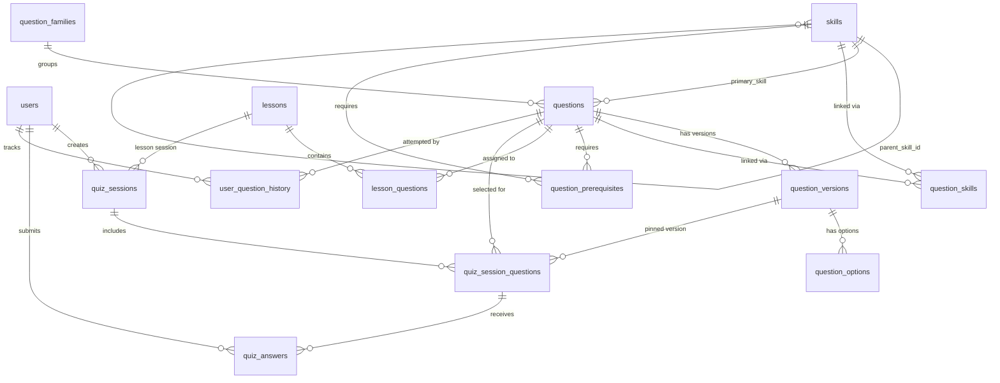

# Data Model

## Overview

The data model is designed for a modular monolith deployed on PostgreSQL. Domain entities are mapped to persistence records at the adapter boundary — ORM records are never exposed to the domain or application layers.

## Current Schema (Migration 0000)

### Enum Types

| Enum               | Values                                                                                           |
| ------------------ | ------------------------------------------------------------------------------------------------ |
| difficulty          | EASY, MEDIUM, HARD, EXPERT                                                                       |
| reasoning_level     | RECOGNIZE, APPLY, ANALYZE, COMBINE                                                               |
| question_type       | SINGLE_CHOICE, MULTIPLE_CHOICE, TRUE_FALSE, CODE_OUTPUT, BUG_IDENTIFICATION, ORDERING, CODE_COMPLETION, ARCHITECTURE_SCENARIO |
| question_status     | DRAFT, IN_REVIEW, PUBLISHED, ARCHIVED                                                            |
| criticality         | NORMAL, IMPORTANT, CRITICAL                                                                      |
| skill_role          | PRIMARY, SECONDARY, CONTEXT                                                                      |
| selection_reason    | NEW_CONTENT, CURRENT_TOPIC, SPACED_REVIEW, WEAK_SKILL, PREREQUISITE_CHECK, CHALLENGE, FINAL_ASSESSMENT |
| lesson_question_role| INTRODUCTION, REGULAR, REVIEW, CHALLENGE, FINAL_ASSESSMENT                                       |
| session_type        | daily, lesson, review, challenge, final_assessment                                               |
| session_status      | ACTIVE, COMPLETED, EXPIRED, ABANDONED                                                            |

### Tables

| Table                    | Purpose                                      | Key Columns                                         |
| ------------------------ | -------------------------------------------- | --------------------------------------------------- |
| users                    | Stub user table (FK target)                  | id, email, role                                     |
| skills                   | Hierarchical skill tree                      | id, parent_skill_id, code, name, category           |
| question_families        | Groups variant wordings of same concept      | id, code, name                                      |
| lessons                  | Stub lesson table (FK target)                | id, title, module_id                                |
| questions                | Question metadata and classification         | id, slug, primary_skill_id, difficulty, status       |
| question_versions        | Immutable version snapshots of question text | id, question_id, version_number, prompt, correct_answer |
| question_options         | Answer options for a question version        | id, question_version_id, option_key, content        |
| question_skills          | Many-to-many questions ↔ skills              | question_id, skill_id, role, weight                 |
| question_prerequisites   | Minimum mastery required to attempt          | question_id, skill_id, minimum_mastery              |
| lesson_questions         | Questions assigned to a lesson               | lesson_id, question_id, role, weight                |
| quiz_sessions            | User quiz session lifecycle                  | id, user_id, session_type, status, session_date     |
| quiz_session_questions   | Questions selected for a session             | id, session_id, question_id, selection_reason       |
| quiz_answers             | User answer submissions (server-evaluated)   | id, session_question_id, user_id, is_correct, score |
| user_question_history    | Per-user per-question attempt tracking       | user_id, question_id, total_attempts, next_eligible_at |

### Key Design Decisions

- **Question versioning**: Questions are immutable once published. Corrections create a new `question_version`. The `current_version_number` on `questions` points to the latest.
- **Server-side evaluation**: `correct_answer` lives in `question_versions` and is never exposed to the client. Answer correctness is computed server-side.
- **Idempotency**: `quiz_answers.idempotency_key` prevents duplicate submissions.
- **Spaced repetition**: `user_question_history.next_eligible_at` controls when a question becomes eligible again for a user.
- **Difficulty vs reasoning**: `difficulty` (EASY→EXPERT) is independent from `reasoning_level` (RECOGNIZE→COMBINE). A question can be EASY+ANALYZE or HARD+RECOGNIZE.
- **Skill hierarchy**: `skills.parent_skill_id` creates a tree (e.g., JavaScript → Closures → Lexical Scope).

## Common Audit Fields

Every table includes:

```sql
created_at  TIMESTAMPTZ NOT NULL DEFAULT now()
updated_at  TIMESTAMPTZ NOT NULL DEFAULT now()
```

`updated_at` is maintained by an application-level update on every write.

## Idempotency Keys

Actions that must not be repeated (e.g., answer submissions) use a unique `idempotency_key` column with a `UNIQUE` constraint. A duplicate key causes a database-level conflict that the application handles gracefully.

## Migration Strategy

- All schema changes use versioned Drizzle migrations (`database/migrations/`).
- Generate with: `npm run db:generate`
- Apply with: `npm run db:migrate` (using `DIRECT_DATABASE_URL`)
- Never edit a migration that has already been applied in any environment.
- Write a new migration to correct or evolve the schema.

## Domain-to-Persistence Mapping

Each repository adapter maps between:

- **Domain object:** Pure TypeScript class/interface, no ORM imports
- **Persistence record:** Drizzle select/insert type from the schema

Example:

```ts
// Domain
interface User { id: string; email: string; role: UserRole; createdAt: Date; }

// Persistence record (Drizzle)
type UserRecord = typeof users.$inferSelect;

// Adapter mapping
function toDomain(record: UserRecord): User { ... }
function toPersistence(user: User): typeof users.$inferInsert { ... }
```

## Entity-Relationship Diagram


