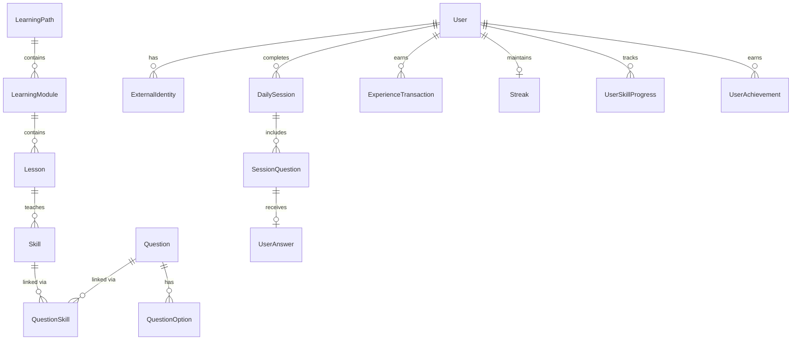

# Data Model

## Overview

The data model is designed for a modular monolith deployed on PostgreSQL. Domain entities are mapped to persistence records at the adapter boundary — ORM records are never exposed to the domain or application layers.

## Planned Entities

The schema grows incrementally. Entities are introduced per stage.

| Entity                | Stage | Module       |
| --------------------- | ----- | ------------ |
| User                  | 1     | users        |
| ExternalIdentity      | 1     | identity     |
| LearningPath          | 2     | learning     |
| LearningModule        | 2     | learning     |
| Lesson                | 2     | learning     |
| Skill                 | 2     | learning     |
| Question              | 2     | questions    |
| QuestionOption        | 2     | questions    |
| QuestionSkill         | 2     | questions    |
| PlacementTest         | 2     | learning     |
| DailySession          | 3     | sessions     |
| SessionQuestion       | 3     | sessions     |
| UserAnswer            | 3     | sessions     |
| ExperienceTransaction | 4     | gamification |
| Streak                | 4     | gamification |
| Achievement           | 4     | gamification |
| UserAchievement       | 4     | gamification |
| UserSkillProgress     | 5     | progress     |

## Stage 0 Schema

The Stage 0 schema is intentionally empty. The first migration establishes the baseline and verifies the toolchain. Tables are added in Stage 1.

## Common Audit Fields

Every table will include:

```sql
created_at  TIMESTAMPTZ NOT NULL DEFAULT now()
updated_at  TIMESTAMPTZ NOT NULL DEFAULT now()
```

`updated_at` is maintained by an application-level update on every write.

## Soft Deletion

Sensitive records (users, questions) use soft deletion:

```sql
deleted_at  TIMESTAMPTZ NULL
```

Queries filter `WHERE deleted_at IS NULL` by default.

## Idempotency Keys

Actions that must not be repeated (e.g., XP awards, session completion) use a unique `idempotency_key` column with a `UNIQUE` constraint. A duplicate key causes a database-level conflict that the application handles gracefully.

## Migration Strategy

- All schema changes use versioned Drizzle migrations (`database/migrations/`).
- Generate with: `npm run db:generate`
- Apply with: `npm run db:migrate` (using `DIRECT_DATABASE_URL`)
- Never edit a migration that has already been applied in any environment.
- Write a new migration to correct or evolve the schema.

## Domain-to-Persistence Mapping

Each repository adapter maps between:

- **Domain object:** Pure TypeScript class/interface, no ORM imports
- **Persistence record:** Drizzle select/insert type from the schema

Example (Stage 1):

```ts
// Domain
interface User { id: string; email: string; role: UserRole; createdAt: Date; }

// Persistence record (Drizzle)
type UserRecord = typeof users.$inferSelect;

// Adapter mapping
function toDomain(record: UserRecord): User { ... }
function toPersistence(user: User): typeof users.$inferInsert { ... }
```

## Entity-Relationship Diagram (Planned — Stage 5)


